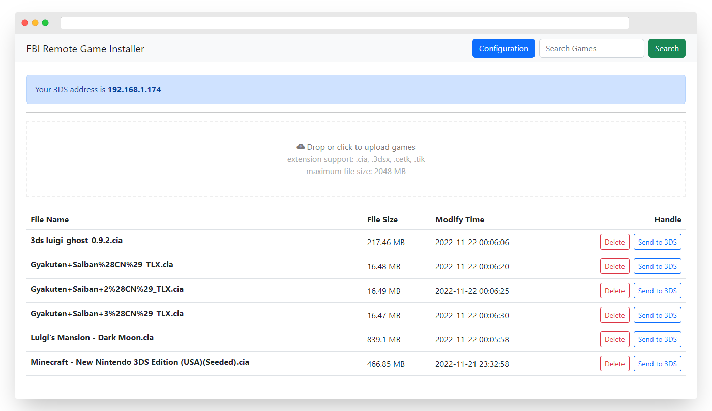
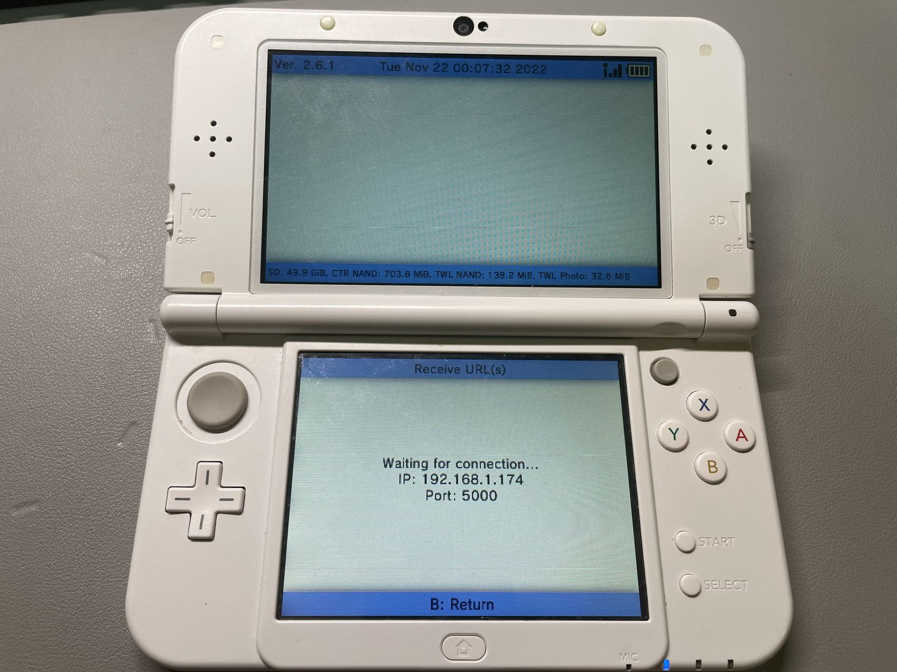
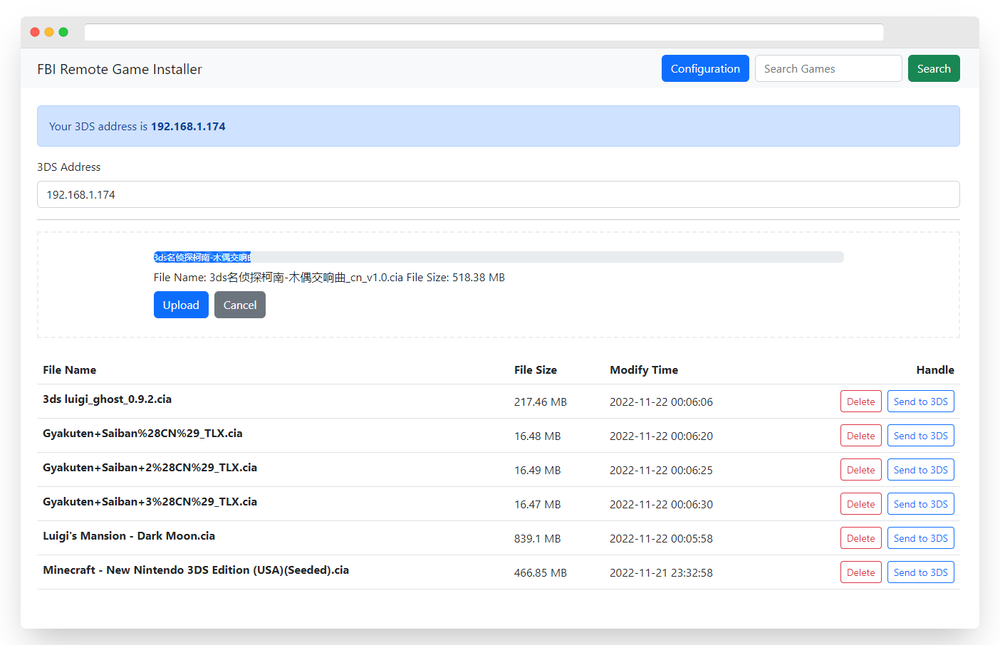
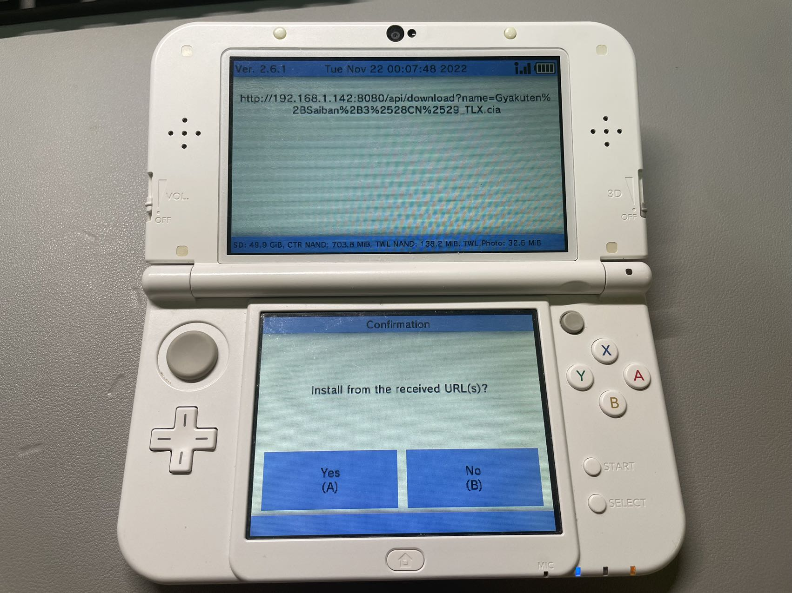

# FBI Remote Game Installer

FBI_Installer is a tool that is used to install CIA format games to 3DS, without removing the screw.

## Running

### Mac/Linux

```shell
$ fbi_installer.exe start -h
NAME:
   fbi_installer start - start the FBI Remote Installer daemon

USAGE:
   fbi_installer start [command options] [arguments...]

OPTIONS:
   --listen value, -l value    listen address (default: ":8080")
   --data-dir value, -d value  CIA data directory
   --base-url value, -u value  base url for this server
   --help, -h                  show help (default: false)
```

Use `-d` option to specify a directory to save the game files. 

Use `-u` option to specify the base URL that is provided to 3DS to download the games, it's usually your computer's IP address.

Use `-l` option to specify the listening address.

For example:

```shell
./fbi_installer start -l 0.0.0.0:8080 -d ./data -u http://192.168.1.142:8080
```

## Usage

First, Launch the FBI_Installer and you can get the game upload and list view:



Then enter the FBI app in 3DS and get the IP address:



Drop or click the file box to upload the games:



Click the "send to 3ds" button in game list, and confirm it in 3DS:


